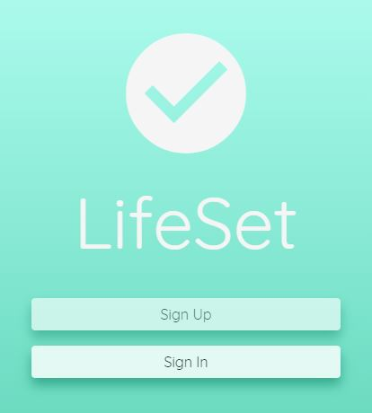
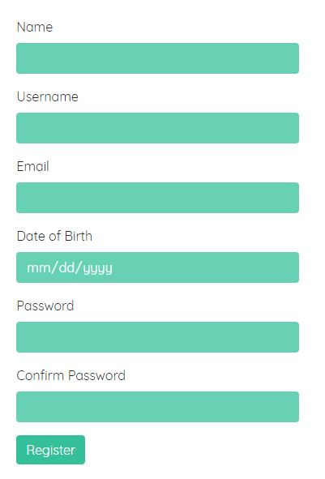
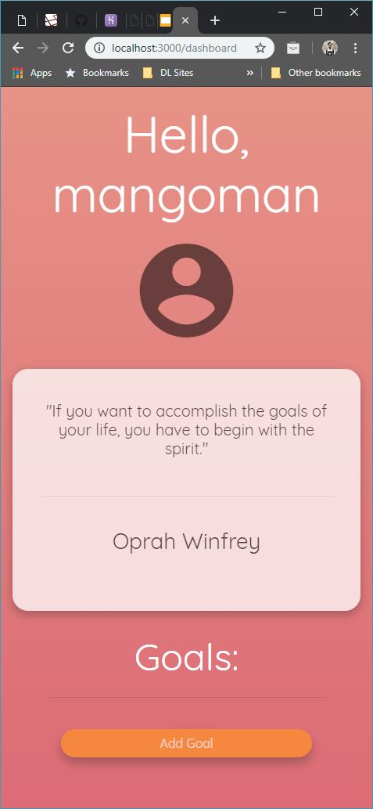
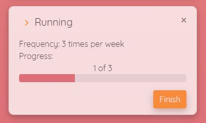
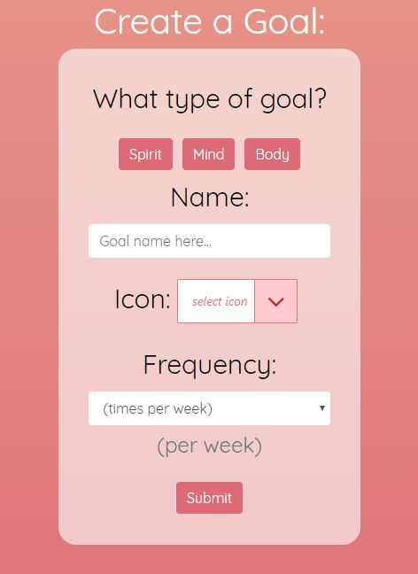
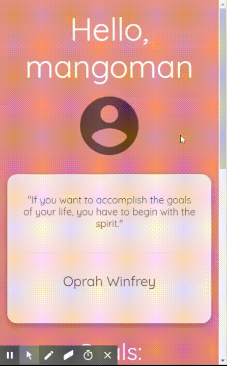

# LifeSet Goal tracker (v1)

## LifeSet is an app... ## 
for the users out that trying to organize their priorities and achieve goals that they are tasking themselves to achieve. This app makes it easy to create goals for ourselves and keep track of each goal's progress.

## Why this app is needed... ##
For many people, they have many skills they want to learn/achieve/habitualize. Many people want to eat healthier, exercise more often, or read more books, but don't know to stay on top of them. Our app provides users with an easy way to keep track of the goals they set for themselves as well as the (weekly) progress of each goal.

## How to use LifeSet... ##
### 1. Signup / Login ###
The app requires the user to create an account to be able to use the application, so the user will be guided to create an account, or login if he/she has an account already.

### 2. The dashboard ###
Upon signup or login, the user is brought to a dashboard page. This is the hub of the app and where everything stems from. The user will be greeted to their profile icon, name and random inspirational quote. He/she will also be able to create and manage goals from here.

#### Each goal shows: ####

1. An icon visualizing the goal
2. The name of goal
3. The (weekly) frequency of that goal
4. The current progress of that goal (visually represented as text and a progress bar)
5. A delete button to remove the goal

### 3. Goal creation ###
Upon clicking the "Add goal" button, the user is taken to a simple form to fill out the details of the goal in mind. We don't want to bog down the user with too many details, so the user is asked to fill out the bare minimum for convenience/ simplicity. Details will be added later.

### 4. Finishing a goal ###
Once the user wants to finish a goal, it is as simple as pressing the "Finish" button of the goal. This will update the progress of the goal and the user can see the progress bar increasing.

## Tech Involved: ##
Several technologies were used to create LifeSet.
The list includes:
- MongoDB w/ Mongoose ORM
- Express.js routing
- React.js w/ React Router
- Reactstrap component library
- React fonticonpicker component library
- Node.js
- Passport.js 
- Bootstrap v4

## Commit History: ##
The commit hisotry can be viewed [here!](https://github.com/burkeri/FinalProject_MERN/commits/master)

